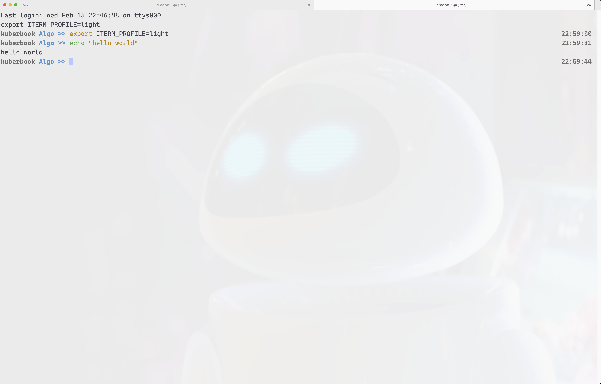
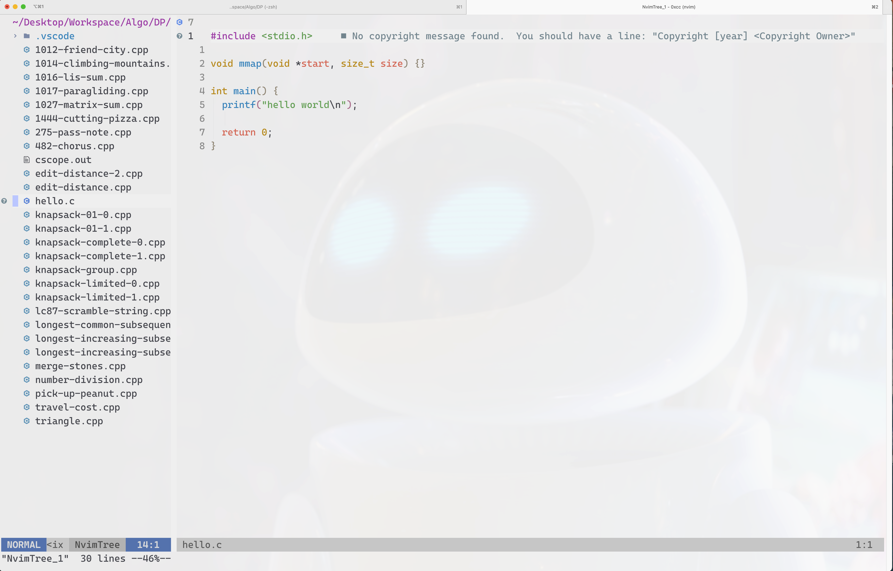
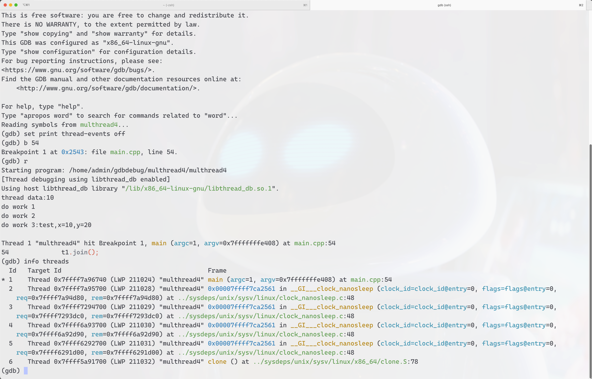

# Editor Configuration

## Components

Components:

- iterm2
- neovim
- lua runtime

Lua configure is listed in this repository.

## Demo

Here are screenshot for my configuration.

- light theme

- dark theme

contact: matt.0xcc@gmail.com
